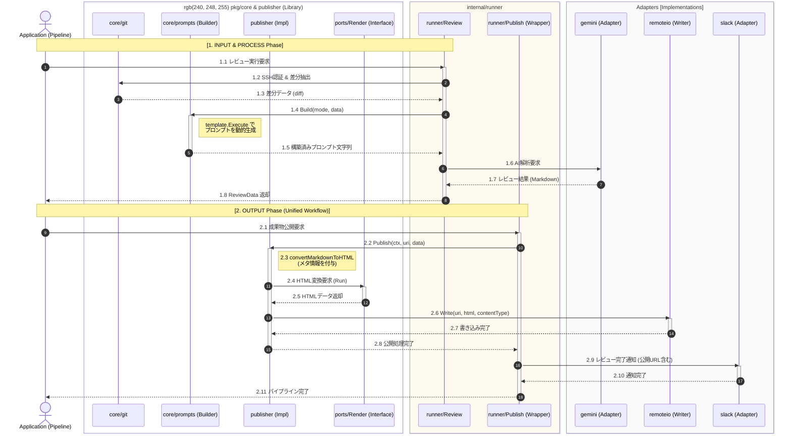

# 🤖 Code Reviewer

[](https://golang.org/)
[](https://golang.org/)
[](https://github.com/shouni/code-reviewer/tags)
[](https://opensource.org/licenses/MIT)

## 🚀 概要 (About) - AI 連携のインプットからアウトプットまでを一気通貫で。

**Code Reviewer** は、Google Gemini API を核とした AI コードレビューのための **高機能ツールキット** です。

ソースコードの抽出（Input）、AI モデルへの最適化（Process）、そしてマルチプラットフォームへの配信（Output）まで。AI 連携に必要なすべてのコンポーネントを独立したパッケージとして提供します。CLI ツールの構築からエンタープライズな Web アプリケーションのバックエンドまで、一貫したレビューパイプラインを迅速に実装可能です。

---

## 🏗 アーキテクチャ設計 (Architecture)

本プロジェクトは、保守性とテスト容易性を最大化するため、**クリーンアーキテクチャ**の思想を取り入れ、外部依存（インフラ）とビジネスロジックを厳格に分離したレイヤー構造を採用しています。

### レイヤー構成の境界

* **Core (抽象定義・共通ドメイン):**
  `core/ports` を中心としたシステムの核。インターフェース定義（Ports）により、具体的な実装（Adapters）に依存しないビジネスルールを規定します。
* **Adapters (具象実装):**
  `gemini`, `slack`, `remoteio`, `md` など、外部サービスや特定の技術スタックに依存する実装。Core の Port を実装し、プラグインのように容易に差し替え可能です。
* **Cross-Cutting Concerns (基盤・ユーティリティ):**
  `armor`, `httpkit`, `utils` など、全レイヤーから利用されるセキュリティ、リトライ、通信、共通処理の基盤。

---

## 🔄 シーケンスフロー (Sequence Flow)



---

### プロジェクト構成図 (Directory Tree)

```text
code-reviewer/
├── core/                # 【最重要】ドメイン境界・抽象インターフェース
│   ├── ports/           # AI, Git, Publisher などの抽象定義 (Interface)
│   ├── ai/              # AI 連携の共通ロジック
│   ├── git/             # Git 操作のコア・認証・ローカル管理
│   ├── prompts/         # プロンプト構築エンジン
│   ├── publisher/       # 成果物出力のオーケストレーション
│   └── resource/        # リソースローダー
├── md/                  # Markdown 変換・HTML レンダリング基盤
│   ├── converter/       # Markdown 解析・変換
│   ├── renderer/        # HTML テンプレート・CSS 定義
│   └── runner/          # レンダリング実行パイプライン
├── gemini/              # Gemini API クライアント (File API 対応)
├── slack/               # Slack 通知基盤 (Block Kit 対応)
├── remoteio/            # クラウドストレージ (GCS/S3) 抽象化レイヤー
├── armor/               # 防御層 (SSRF 対策・リトライ戦略)
├── httpkit/             # 高機能 HTTP クライアント (Stream, Option 対応)
├── clibase/             # CLI 実行基盤 (Cobra 統合)
└── utils/               # 共通ユーティリティ (env, text, time, path)
```

---

### 主要パッケージの役割詳細

| パッケージ | 概要 |
| :--- | :--- |
| **`core/ports`** | システムが外部（AI, Git, 保存先）に求める契約を定義。DIP の要。 |
| **`core/git`** | SSH認証をサポートした、セキュアで柔軟な Git リポジトリ操作。|
| **`armor`** | `securenet` による通信先検証と `retry` による堅牢な実行制御。 |
| **`gemini`** | `File API` を含む Google Gemini 固有の通信・型定義を集約。 |
| **`md`** | テンプレートエンジンを用いた HTML レポート生成を担う独立した変換層。 |
| **`remoteio`** | プロトコル（gs://, s3://）を意識せずにファイルを読み書きする抽象化。 |

---

### 💡 設計のハイライト

* **DIP (依存性逆転の原則):** `core/ports` を介することで、ビジネスロジックを変更せずに AI モデルや通知先を自在にスワップ可能です。
* **Security by Design:** `armor/securenet` により、内部ネットワークへの意図しないアクセス (SSRF) を防ぎ、エンタープライズ品質の安全な通信を保証します。
* **High Reliability:** `httpkit` と `armor/retry` が連携し、不安定なネットワーク環境下でも AI 連携の完遂率を最大化します。
* **Cloud Native Ready:** `remoteio` により、ローカル、GCS、S3 などのストレージ環境を意識せず、シームレスに成果物をデプロイできます。

---

### 📜 ライセンス (License)

このプロジェクトは [MIT License](https://opensource.org/licenses/MIT) の下で公開されています。

---

